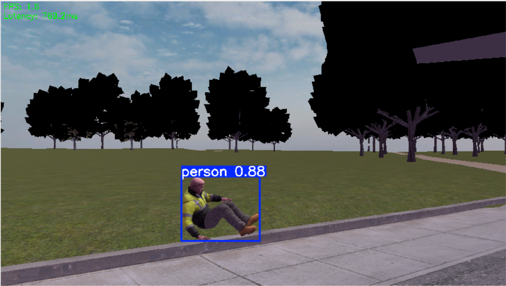
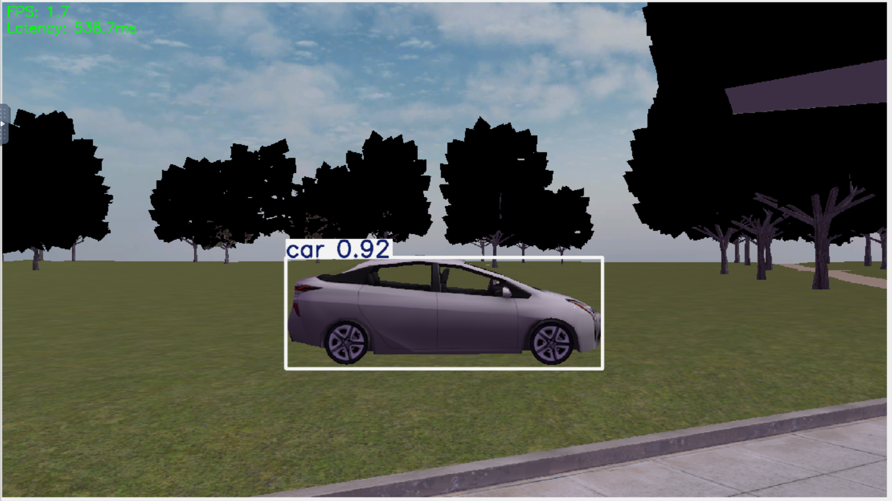
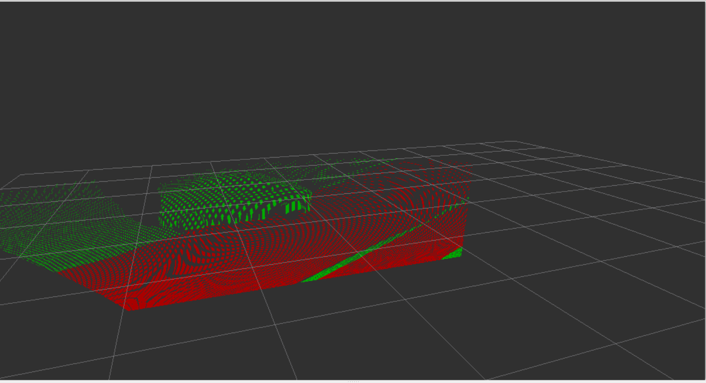

# PX4 Perception

**DevOps for Cyber-Physical Systems (HS 2026)**  
**Repository:** https://github.com/ColorfulGoat/px4-sim

---

## Overview

This repository implements two perception tasks for a simulated UAV (Unmanned Aerial Vehicle) using PX4 SITL, ROS2 Jazzy, and Gazebo Harmonic running inside a fully containerized Docker environment.

- **Aufgabe 1:** Real-time object detection using YOLOv8 on the drone's RGB camera stream
- **Aufgabe 2:** Depth estimation and 3D point cloud generation with RANSAC ground plane segmentation

---

## Environment & Prerequisites

- Docker Desktop (Windows 11)
- Git Bash (for running shell scripts on Windows)
- NoVNC browser access for GUI visualization

### Stack
- ROS2 Jazzy Jalisco
- Gazebo Harmonic
- PX4 SITL (`gz_x500_depth` vehicle)
- MAVROS
- Ultralytics YOLOv8
- Open3D / scikit-learn (RANSAC)

---

## Setup & Installation

### 1. Clone the repository

```bash
git clone https://github.com/ColorfulGoat/px4-sim
cd px4-sim
```

### 2. Fix line endings (Windows only)

```bash
sed -i 's/\r//' build.sh
sed -i 's/\r//' px4_entrypoint.sh
sed -i 's/\r//' ros_entrypoint.sh
```

### 3. Build the Docker environment

Open Git Bash in VS Code and run:

```bash
bash build.sh --all
```

> ⚠️ This will take 20–40 minutes on first run as it downloads and builds all dependencies.

### 4. Start the containers

```bash
docker-compose up
```

---

## Running the Simulation

You will need **5 terminal tabs** open simultaneously, all using Git Bash inside VS Code. For tabs 2–5, exec into the running container:

```bash
docker exec -it px4_sitl bash
```

### Tab 1 — Docker Compose (leave running)
```bash
docker-compose up
```

### Tab 2 — PX4 SITL + Gazebo
```bash
cd /root/PX4-Autopilot
PX4_GZ_WORLD=baylands make px4_sitl gz_x500_depth
```

Once loaded, arm and take off from the PX4 console:
```bash
param set COM_ARM_WO_GPS 1
param set COM_RC_IN_MODE 4
param set NAV_DLL_ACT 0
param set NAV_RCL_ACT 0
commander takeoff
```

### Tab 3 — ROS-Gazebo Bridge
```bash
ros2 run ros_gz_bridge parameter_bridge \
  /world/baylands/model/x500_depth_0/link/camera_link/sensor/IMX214/image@sensor_msgs/msg/Image@gz.msgs.Image \
  /world/baylands/model/x500_depth_0/link/camera_link/sensor/IMX214/camera_info@sensor_msgs/msg/CameraInfo@gz.msgs.CameraInfo \
  /depth_camera@sensor_msgs/msg/Image@gz.msgs.Image \
  /depth_camera/points@sensor_msgs/msg/PointCloud2@gz.msgs.PointCloudPacked
```

### Tab 4 — YOLO Detection Node (Aufgabe 1)
```bash
cd /root/ros2_ws
source install/setup.bash
ros2 run yolo_detection yolo_node
```

### Tab 5 — Point Cloud Node (Aufgabe 2)
```bash
cd /root/ros2_ws
source install/setup.bash
ros2 run point_cloud_node pc_node
```

---

## GUI Access

Open your browser and navigate to:

```
http://localhost:6080/vnc.html
```

Password: `1234`

This opens the NoVNC desktop where you can run RViz2 and rqt_image_view.

---

## Aufgabe 1: Object Detection with YOLO

### Objective
Develop a ROS2 node that performs real-time object detection on the drone's RGB camera stream using YOLOv8.

### Implementation

The YOLO detection node is located at:
```
ros2_ws/src/yolo_detection/yolo_detection/yolo_node.py
```

It subscribes to the drone's RGB camera topic, runs YOLOv8n inference on each frame, and publishes an annotated image with bounding boxes, class labels, confidence scores, FPS and latency overlaid.

**ROS2 Topics:**

| Topic | Type | Description |
|---|---|---|
| `/world/baylands/model/x500_depth_0/link/camera_link/sensor/IMX214/image` | `sensor_msgs/Image` | Input RGB camera feed |
| `/yolo/detection_image` | `sensor_msgs/Image` | Annotated output with detections |

### Visualizing Detections

Open a new terminal and run:

```bash
source /opt/ros/jazzy/setup.bash
source /root/ros2_ws/install/setup.bash
ros2 run rqt_image_view rqt_image_view
```

Select `/yolo/detection_image` from the dropdown to see the live annotated feed.

### Model & Performance

- Model: YOLOv8n (nano) — optimized for CPU inference
- Confidence threshold: 0.1 (because gazebo has not detailed 3D renders)
- Average latency: ~400–600ms (CPU only, no GPU in container)
- Detected object classes include: person, car, and other COCO dataset classes

### Scene Setup

The simulation uses the **Baylands** world with the following objects spawned:
- Rescue Randy (person model) — at position (0, 5, 0)
- Prius Hybrid (car model) — at position (5, 0, 0)

To spawn models inside the container:
```bash
gz fuel download -u "https://fuel.gazebosim.org/1.0/OpenRobotics/models/Rescue Randy Sitting"
gz service -s /world/baylands/create \
  --reqtype gz.msgs.EntityFactory \
  --reptype gz.msgs.Boolean \
  --timeout 5000 \
  --req 'sdf_filename: "/root/.gz/fuel/fuel.gazebosim.org/openrobotics/models/rescue randy sitting/1/model.sdf" pose: {position: {x: 0, y: 5, z: 0}}'
```

### Screenshots
 
> 
> 

---

## Aufgabe 2: Depth Estimation and 3D Point Cloud Generation

### Objective
Implement a ROS2 node that processes depth camera data, generates 3D point clouds, and segments the ground plane from obstacles using RANSAC.

### Implementation

The point cloud node is located at:
```
ros2_ws/src/point_cloud_node/point_cloud_node/pc_node.py
```

It subscribes to the depth camera point cloud topic, filters out invalid (inf/NaN) points, applies RANSAC to separate the ground plane from obstacles, and publishes two separate filtered point clouds.

**ROS2 Topics:**

| Topic | Type | Description |
|---|---|---|
| `/depth_camera/points` | `sensor_msgs/PointCloud2` | Raw point cloud from depth camera |
| `/pointcloud/obstacles` | `sensor_msgs/PointCloud2` | Filtered obstacle points (non-ground) |
| `/pointcloud/ground` | `sensor_msgs/PointCloud2` | Segmented ground plane points |

### RANSAC Ground Plane Segmentation

The node uses scikit-learn's `RANSACRegressor` to fit a plane model `z = ax + by + c` to the point cloud. Points within 10cm of the fitted plane are classified as ground; all others are classified as obstacles.

### Visualizing in RViz2

In a new terminal run:

```bash
source /opt/ros/jazzy/setup.bash
source /root/ros2_ws/install/setup.bash
rviz2
```

Configure RViz2:
1. Set **Fixed Frame** to `camera_link`
2. Click **Add** → **By topic** → `/pointcloud/obstacles` → **PointCloud2**
3. Click **Add** → **By topic** → `/pointcloud/ground` → **PointCloud2**
4. Set obstacle cloud color to **red** and ground cloud color to **green**

### Screenshots
> ## The object detected is a car

> ## The **green** color represents obstacles and the **red** the ground
> 

---

## Repository Structure

```
px4-sim/
├── build.sh                  # Build script for Docker environment
├── docker-compose.yml        # Docker services configuration
├── px4_entrypoint.sh         # PX4 container entrypoint
├── ros_entrypoint.sh         # ROS2 container entrypoint
└── ros2_ws/
    └── src/
        ├── yolo_detection/   # Aufgabe 1: YOLO detection node
        │   └── yolo_detection/
        │       └── yolo_node.py
        ├── point_cloud_node/ # Aufgabe 2: Point cloud node
        │   └── point_cloud_node/
        │       └── pc_node.py
        └── yolo_msgs/        # Custom ROS2 message definitions
```

---

## Dependencies

All dependencies are pre-installed in the Docker container. Key Python packages:

```
ultralytics==8.4.41
numpy==1.26.4
scikit-learn
open3d
torch==2.2.0
```

> ⚠️ **Note on numpy:** This environment requires `numpy==1.26.4` strictly. Installing other packages may upgrade numpy and break cv_bridge compatibility. If this happens, run:
> ```bash
> python3 -m pip install "numpy==1.26.4" --break-system-packages --force-reinstall
> ```

---

## Troubleshooting

**`exec /px4_entrypoint.sh: no such file or directory`**  
Windows line endings issue. Fix with:
```bash
sed -i 's/\r//' px4_entrypoint.sh
```

**`ModuleNotFoundError: No module named 'ultralytics'`**  
Reinstall with:
```bash
python3 -m pip install ultralytics --break-system-packages --ignore-installed
```

**`RuntimeError: Numpy is not available`**  
Pin numpy back to 1.26.4:
```bash
python3 -m pip install "numpy==1.26.4" --break-system-packages --force-reinstall
```

**Drone won't arm**  
Run in PX4 console:
```bash
param set COM_ARM_WO_GPS 1
param set COM_RC_IN_MODE 4
```
